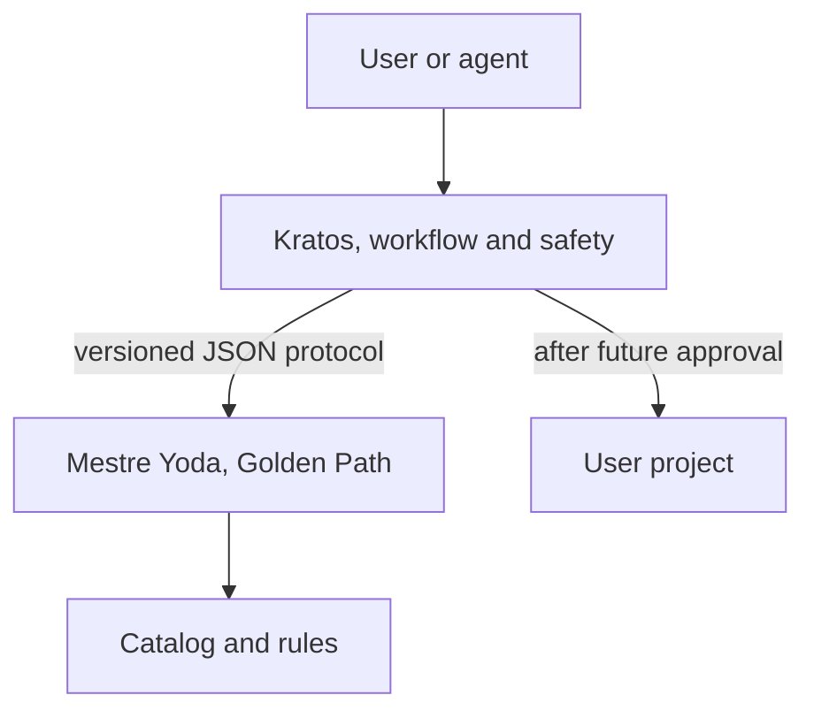

# Architecture

## Responsibility

Mestre Yoda is the versioned source of the Golden Path. It answers which
decisions, policies, recipes, and gates should guide a system, and it evaluates
objective signals found in a repository. It does not drive agents, does not hold
the state of a task, and does not modify projects in version 0.1.

Kratos and Mestre Yoda stay in separate remote repositories. The future
dependency points from Kratos to the public contract of Mestre Yoda. Mestre Yoda
knows nothing about Kratos internals, skills, or directories.

In the current version, a person or a pipeline can also run the CLI directly. In
that mode every command is read-only.

## Components

| Component | Responsibility |
|---|---|
| `catalog/profiles` | Versioned profiles, policies, recipes, and quality gates |
| `schemas` | Public JSON Schema contracts |
| `src/core/project.mjs` | Safe inventory and deterministic signal detection |
| `src/core/evaluator.mjs` | Conformity, recommendation, and read-only planning |
| `src/core/protocol.mjs` | Stable envelope for external consumers |
| `src/cli.mjs` | Human and JSON interfaces over the same core |

## Evaluation flow

1. The CLI resolves the requested directory and rejects roots that are not real
   directories.
2. The inspector skips build artifacts, installed dependencies, and symbolic
   links.
3. Text files within the safety limits are read as data. No project file is
   imported or executed.
4. The detected signals are compared against the rules of the profile.
5. The report computes the weighted score and identifies blocking failures.
6. `plan` orders the remediations, but returns `readOnly: true` and
   `effects: []`.

## Determinism and integrity

- directories, files, rules, and tasks all have a stable ordering;
- each profile gets a SHA-256 digest over its canonical content;
- each plan gets a SHA-256 identifier over the profile, the signals, and the tasks;
- the catalog never loads code from inspected projects;
- version 0.1 has no write API at all.

## Safety limits of the inspector

The inspector is the only component that touches foreign files, so its limits
are part of the contract:

| Limit | Value | Reason |
|---|---|---|
| Files walked | 5000 | Bounds the walk on a monorepo and fails loudly instead of hanging |
| Bytes per file | 512 KiB | Skips vendored blobs and generated bundles |
| Bytes per corpus | 8 MiB | Keeps peak memory predictable |
| Symbolic links | refused | A link can point outside the requested root |
| Skipped directories | `.git`, `.idea`, `.next`, `.vscode`, `bin`, `coverage`, `dist`, `node_modules`, `obj` | Build output and installed dependencies are not evidence about the source |

Files with a null byte are treated as binary and dropped. A malformed
`package.json` is evidence of absence, never something to run.

## Boundary for the future integration

Kratos will be able to call `handshake`, select a profile by `id`, validate its
version and digest, obtain a plan, and store that plan as evidence. A future
version of the protocol may declare file operations. Even then, Mestre Yoda only
plans: approval, backup, application, validation, and rollback stay with Kratos.
