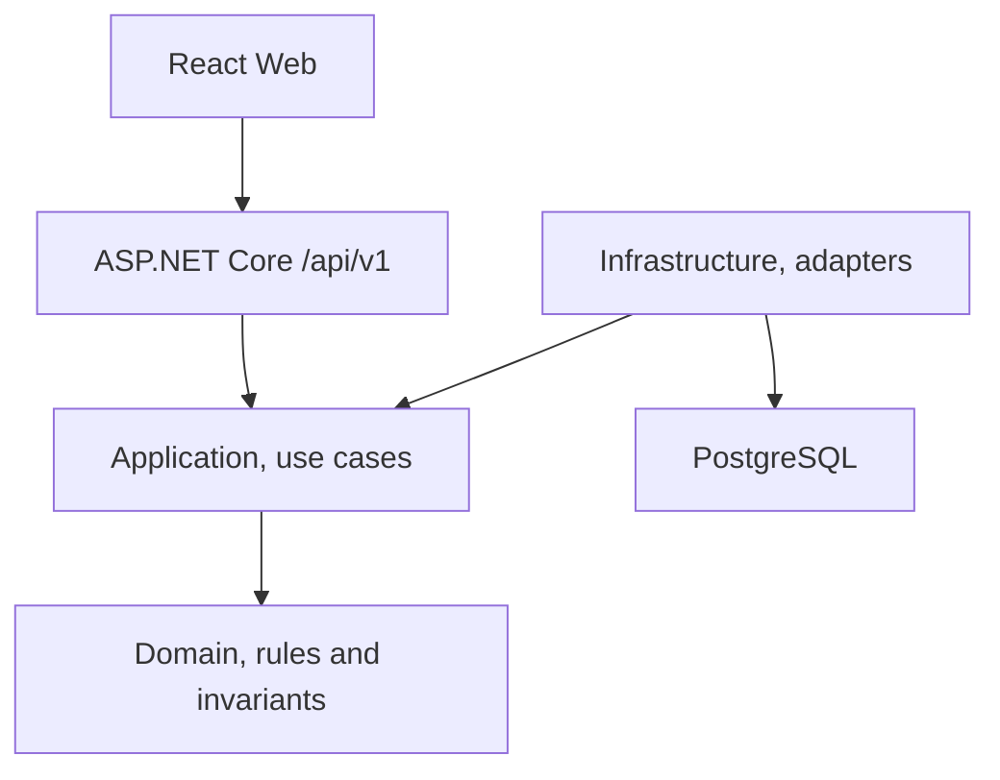

# Profile: .NET modular, React, and PostgreSQL

- Identifier: `dotnet-modular-react-postgresql`
- Profile version: `1.0.0`

## Reference architecture

The starting point is a modular monolith on .NET 10. Each module represents one
business capability and protects its own model, use cases, and persistence. The
HTTP API and the composition host sit at the edge of the system.



This shape keeps a path open toward extracting services later, without paying
the operational cost of microservices up front.

## Core conventions

| Area | Standard |
|---|---|
| Backend | ASP.NET Core .NET 10 |
| Architecture | Modular monolith by business capability |
| API | REST `/api/v1`, OpenAPI, and Problem Details |
| Security | JWT Bearer/OIDC, policies, and default deny |
| Database | PostgreSQL, EF Core with Npgsql, and migrations |
| Frontend | React and TypeScript, without Next.js |
| Observability | Health checks, correlation ID, and structured logs |
| Quality | Unit, integration, and architecture tests, plus critical journeys |

## Optional decisions

- SignalR enters only when something genuinely updates in real time.
- PostGIS enters only when the domain has geospatial queries.
- Row Level Security enters only after an explicit decision about
  multi-tenancy, the tenant model, and the operational strategy.
- Flutter can be added as another client of the same OpenAPI contract.
- The OIDC provider is a configurable adapter, not a dependency of the Domain.

## Recommended conceptual structure

```text
src/
  Api/
  BuildingBlocks/
  Modules/
    <Module>/
      Domain/
      Application/
      Infrastructure/
web/
  src/
    app/
    features/
    shared/
tests/
  UnitTests/
  IntegrationTests/
  ArchitectureTests/
```

This tree is a reference convention, not a template applied by version 0.1. The
detector looks for equivalent signals and does not require any particular
solution name or product name.
